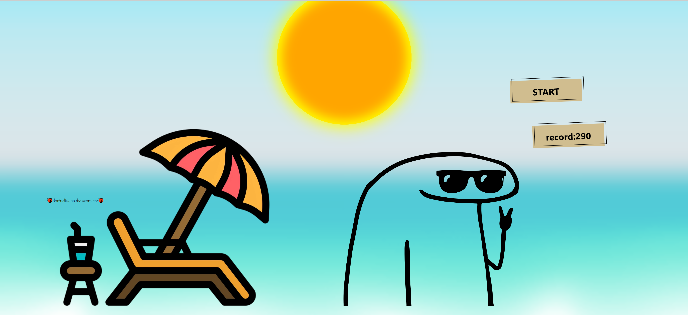
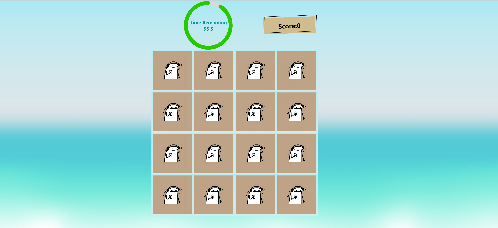
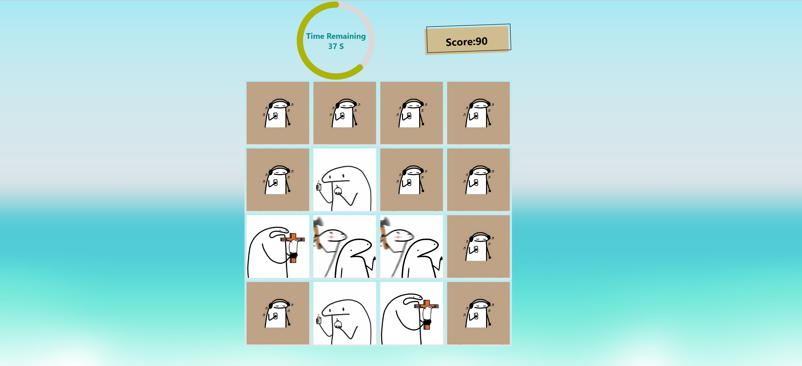
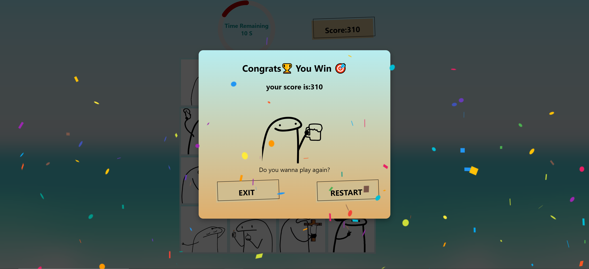
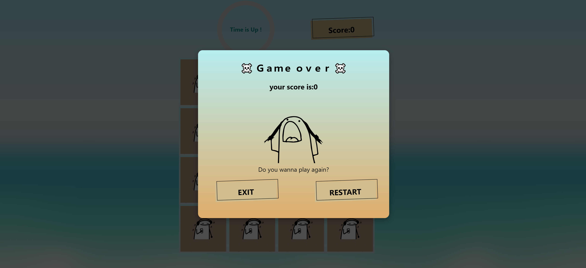

# MIGHOLI

## The Nostalgia Flip Card Memory Game

<div align="center">

</div>


## Introduction

Hello everyone who has had the pleasure of exploring my project As some of you may recognize, these stickers hold a special place in my heart. Motivated by their popularity, I decided to embark on a new adventure—creating a game that encapsulates the essence of these beloved stickers. This journey promises to be an exciting blend of creativity, innovation, and nostalgia, offering a fresh take on the gaming experience. Stay tuned as we dive deeper into this thrilling endeavor.

Have you ever engaged in a memory game, finding delight in the mental exercise it offers? If so, you've likely experienced the thrill of challenging your cognitive abilities. Yet, have you explored the realm of memory games beyond the familiar? The experience awaits, promising a refreshing challenge that's surprisingly straightforward. All you need is a keen focus, a commitment to memorization, and a sharp eye for detail. Your goal? Accumulate as many points as possible, aiming to surpass your peers and emerge victorious. Dive into this engaging world of memory games and elevate your intellectual prowess.

How should I describe the power of this game? 🤔 If you play it; it shows everything about itself🕹️

And I wanted to expand my knowledge about React && TypeScript(TS).
<div align="center">

<h1>&</h1>

</div>

## Installation:

If you want to play it:
you can use `npm` , `yarn` or `bun` to run it.

**NOTE**: Make sure to add `node_modules`

To update and install node_modules run this commands:

```ts
npm install
```
Then :

```ts
npm start
```

or

```ts
yarn start
```
## Game shots
Now, prepare to witness the allure of the game unfold. Let's have fun by playing this game! 😜








## Contributing:
Contributions are welcome! Please feel free to submit a pull request.
َAny advice to improve will be accepted 😏 so feel free to tell me. 🤠🤠

## Support:
A very simple task is to give this project a star⭐.

## License
MIGHOLI is released under the MIT License. See the [LICENSE](LICENSE) file for more details.

## And finally, this story continues.....
[`This project will be in progress`]
