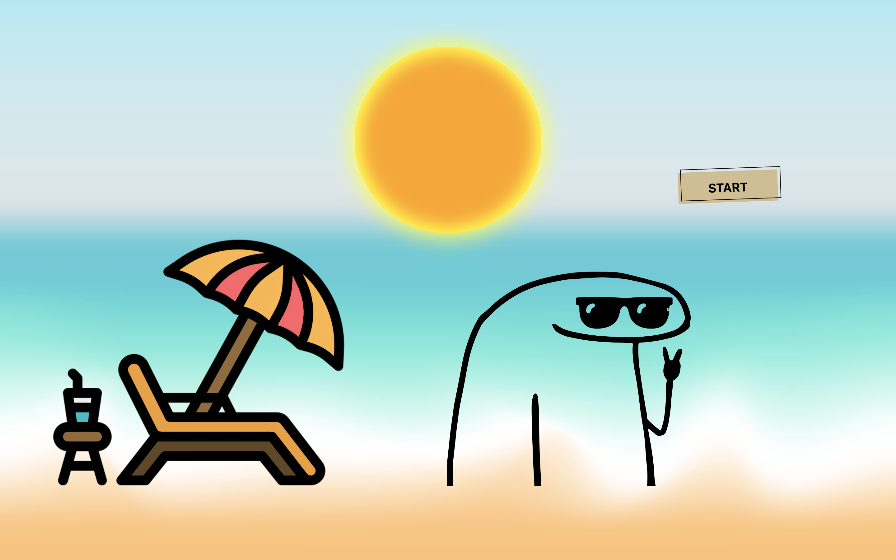
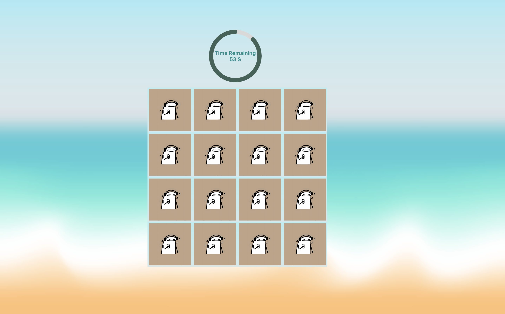
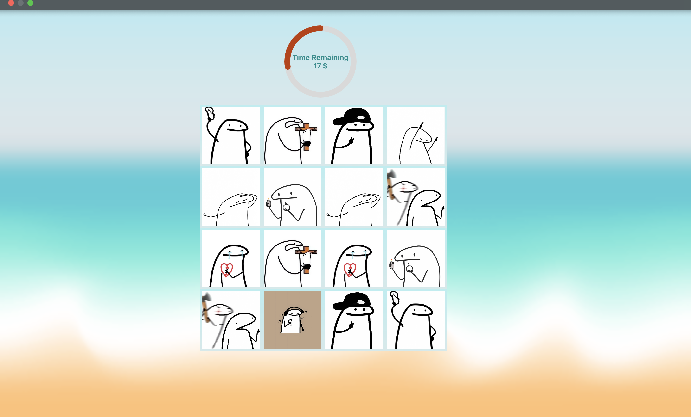
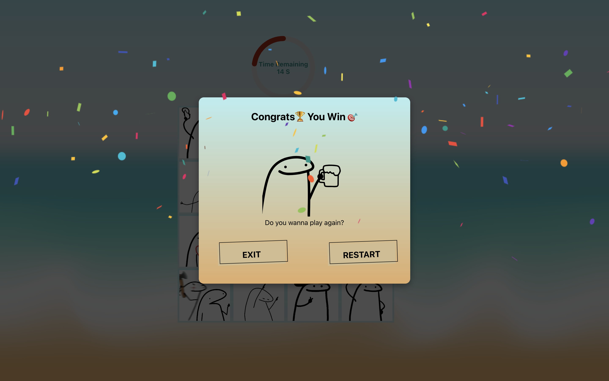
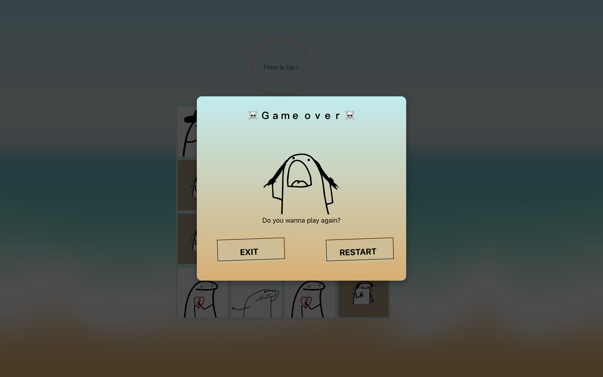

# MIGHOLI_Memory_Game

How should I describe this game? 🤔 If you play it; it shows everything 🕹️

## Introduction

A big hi to everybody who's seen my writing! as some of you may be familiar with these stickers;so I made up my mind to create a game .

And I wanted to expand my knowledge about React && TypeScript(TS).

If you want to play it:

Make sure to add "node_modules" ::

```ts
npm install
```

Then :

```ts
npm start
```

or

```ts
yarn start
```

well ummm I have nothing to offer except these images... Let's have fun by playing this game! 😜







any advice to improve will be accepted 🫡 so feel free to tell me. 🤠🤠

[`This project will be in progress`]
